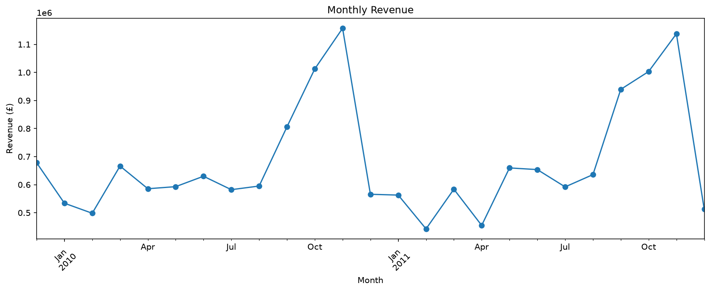
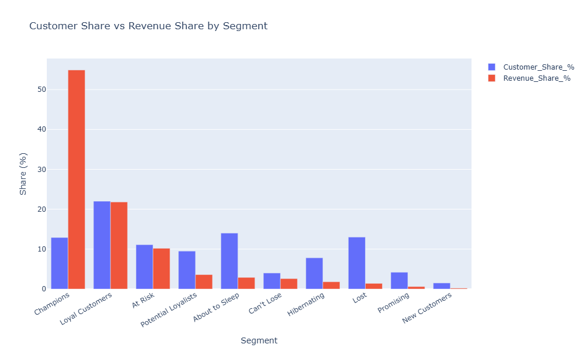

# Customer Segmentation & RFM Analysis

An end-to-end analysis of ~5,900 customers of a UK-based online retailer, using RFM (Recency, Frequency, Monetary) segmentation to identify which customers actually drive the business — and which need attention before they churn.

## Business Question

Not all customers are equal. This project answers: which customers matter most to this business, and what should be done differently for each group?

## Dataset

**Online Retail II** — UCI Machine Learning Repository (id 502)
Real transaction-level data from a UK-based online retailer, Dec 2009 - Dec 2011 (~1 million rows).
[Dataset link](https://archive.ics.uci.edu/dataset/502/online+retail+ii)

*Note: the raw Excel file (~43MB) isn't included in this repo — download it from the link above and place it in the project root as `online_retail_II.xlsx` if you want to reproduce the full pipeline from scratch.*

## Tools

Python, pandas, numpy, matplotlib, seaborn, plotly, Jupyter

## Project Structure

- `analysis.ipynb` — loads the raw data, cleans it (missing IDs, cancellations, fee codes, inconsistent product names), and exports `cleaned_retail_data.csv`
- `visual_eda.ipynb` — exploratory analysis, RFM scoring, customer segmentation, and business insights
- `cleaned_retail_data.csv` — the cleaned dataset (output of `analysis.ipynb`, input to `visual_eda.ipynb`)

**To run:** open and run `analysis.ipynb` first, then `visual_eda.ipynb`.

## Methodology

1. **Cleaning** — removed rows with missing Customer IDs, cancelled orders, non-product fee codes (postage, manual adjustments, discounts), and duplicate rows. Fixed inconsistent product descriptions caused by multiple text variants per product code.
2. **EDA** — examined monthly revenue trends, top products, and revenue by country.
3. **RFM scoring** — calculated Recency, Frequency, and Monetary value per customer, split each into quartiles, and combined them into 10 named segments (Champions, Loyal Customers, At Risk, Lost, etc.) using the standard RFM segment mapping.
4. **Segment analysis** — compared each segment's share of customers against its share of revenue to find where the business's value actually concentrates.

## Key Findings

Revenue shows a strong pre-Christmas seasonal spike each year (Oct-Nov), consistent with a gift-ware retailer.

- **Champions** are 12.9% of customers but generate **54.9%** of total revenue — a strong 80/20 pattern.
- **"About to Sleep"** is the 2nd-largest segment by customer count but only 2.9% of revenue — most of these customers were never big spenders.
- **"At Risk"** customers (650 people, 10.2% of revenue) have already proven their value but haven't purchased recently — the best target for a win-back campaign.

## Recommendations

- **Champions** — loyalty/VIP program to protect this high-value group.
- **At Risk** — targeted win-back campaign (personalized email, limited-time offer).
- **About to Sleep / Hibernating / Lost** — low-cost automated re-engagement only; not worth a dedicated campaign given their low revenue contribution.
- **New Customers** — structured onboarding flow to convert first-time buyers into repeat customers.